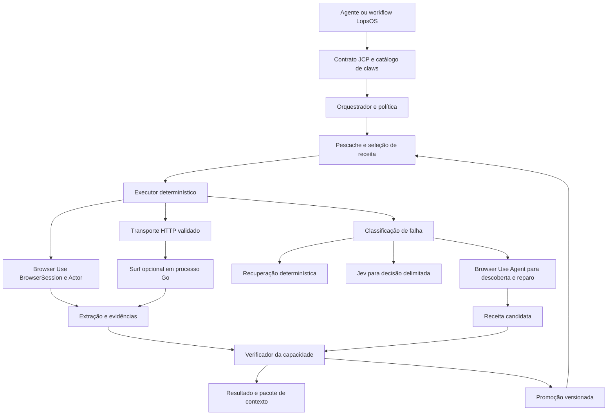

# Visão e decisões de arquitetura

## 1. Problema e resultado esperado

O ecossistema jurídico brasileiro distribui informações entre portais públicos, sistemas processuais autenticados, bases de jurisprudência e ferramentas internas. As mesmas necessidades — localizar processo, consultar movimentos, encontrar decisões, obter documentos — aparecem sob interfaces, vocabulários e mecanismos de acesso diferentes.

O JCP DEVE oferecer essas necessidades como capacidades semânticas tipadas. O agente consumidor conhece a operação e seus argumentos; o runtime conhece o percurso técnico e sua evidência. A interface externa continua estável enquanto a implementação de uma fonte muda.

A proposta é recuperação sob demanda. Uma consulta começa com uma necessidade concreta, escolhe fontes compatíveis, busca informação atual e devolve um pacote de contexto com proveniência. Não depende de uma ingestão prévia do acervo jurídico brasileiro.

O termo aprendizado em contexto descreve o uso das informações recuperadas pelo modelo durante a tarefa. A persistência de receitas é memória operacional externa. Nenhum dos dois exige atualizar os pesos do modelo. Treinamento futuro é uma possibilidade separada, dependente de dados e avaliação próprios.

## 2. O que torna o projeto vertical

Uma automação genérica sabe clicar e extrair texto. A capacidade jurídica DEVE saber o que significa acertar a operação. Exemplos:

- Uma consulta de processo deve confirmar o número e a instalação corretos.
- Uma busca de decisões deve preservar os filtros enviados e declarar quais fontes e páginas percorreu.
- Um documento deve estar ligado ao processo, decisão ou evento de origem.
- Data de disponibilização, publicação, julgamento e captura não podem ser intercambiadas.
- Uma consulta autenticada deve respeitar o contexto do usuário e do processo.
- A abertura de uma comunicação que produz ciência pode ser uma operação com efeito jurídico, mesmo quando o botão parece apenas uma leitura.

O diferencial proposto é a combinação desses contratos com execução reutilizável e reparo que preserva o significado da função.

## 3. Cobertura progressiva

O objetivo de produto é operar qualquer ferramenta jurídica compatível com os transportes disponíveis. A cobertura real DEVE ser declarada por instalação, capacidade e versão. Não existe garantia de que uma receita PJe funcione em todo tribunal ou de que uma navegação descoberta uma vez seja universal.

Cada capacidade terá um nível:

| Nível | Significado |
|---|---|
| discovered | Interface ou fluxo identificado; ainda não validado. |
| experimental | Executa em casos limitados; exige verificação e limites estreitos. |
| certified | Passou pela matriz de aceitação declarada para instalação e contexto. |
| degraded | Regressão ou indisponibilidade detectada; cobertura reduzida. |
| disabled | Suspensa por política, falha ou incompatibilidade. |

Somente `certified` pode ser escolhido automaticamente como receita de produção. Uma execução experimental pode produzir um resultado verificado sem promover automaticamente a receita.

## 4. Arquitetura lógica

Os oito módulos são contratos, orquestração, runtime/sessões, Pescache, decisões Jev, descoberta/reparo, verificação/promoção e governança/evidências. Recuperação de informação, extração e transporte são submódulos desses blocos, não aplicações independentes obrigatórias.

## 5. Decisões principais

### ADR 01 — Browser Use é a base de execução

Usar o fork do Browser Use e sua infraestrutura de sessão, DOM, eventos e ações. Criar um pacote `jcp` dentro do fork e uma fronteira `BrowserUseAdapter` para reduzir dependência direta de detalhes internos. Fixar o commit da base e testar cada atualização.

O caminho estável usa BrowserSession/Actor e ações registradas. O agente generativo é instanciado na descoberta ou no reparo. Um wrapper que sempre chama `Agent.run()` não satisfaz o requisito de zero inferência no caminho determinístico.

### ADR 02 — Contrato semântico estável e receita substituível

`search_decisions` e `get_case` representam necessidades distintas de `click` ou `input`. As primeiras são funções da claw; as segundas são primitivas internas. Não expor detalhes de seletores como argumentos da função de negócio.

### ADR 03 — Receitas estruturadas antes de código arbitrário

A representação principal será uma DSL de passos tipados com pré-condições, operações permitidas, extração e pós-condições. O executor interpreta essa DSL de maneira determinística. Um compilador opcional pode gerar Python a partir dela, mas não é necessário para obter execução sem inferência.

Trechos Python/JavaScript personalizados são extensões versionadas e revisadas. Um reparo de seletor não deve ganhar capacidade de executar comandos de sistema. DSL e código gerado continuam sendo automações determinísticas quando reutilizados.

### ADR 04 — Navegador e HTTP implementam o mesmo contrato

Primeiro estabelecer a correção da função. Depois certificar um caminho HTTP quando houver endpoint ou formulário reproduzível com a mesma autorização e semântica. Surf é uma implementação opcional desse transporte. Não introduzir Go como pré-requisito para a primeira execução do JCP.

A equivalência deve abranger filtros, identidade, paginação, permissões e resultados, não somente código HTTP 200. O navegador pode ser necessário para autenticação ou obtenção de estado efêmero mesmo quando a consulta posterior usa HTTP.

### ADR 05 — Jev decide dentro de opções delimitadas

Usar Jev para escolhas de alvo, estado ou recuperação quando regras forem insuficientes. O modelo recebe candidatos observados e operações compatíveis. Não recebe autoridade para alterar permissões, inventar alvos, certificar uma receita ou declarar completude de uma busca nacional.

### ADR 06 — Evidência faz parte da resposta

Toda resposta bem-sucedida deve permitir identificar fonte, instante, filtros, receita, escopo percorrido e verificações. Hash comprova integridade dos bytes guardados; não comprova sozinho origem, autenticidade ou correção jurídica.

### ADR 07 — Reparo é produção de uma versão candidata

Um fluxo corrigido não substitui imediatamente a versão vigente. A correção tem diferença registrada, testes, evidências, escopo de compatibilidade e rollback. A receita não pode reescrever seus próprios critérios de sucesso para conseguir passar.

### ADR 08 — Monólito modular inicialmente

Começar com aplicação Python, persistência operacional e workers de navegador. Separar processos para isolamento e concorrência, sem criar um serviço de rede por módulo. O worker Surf é um processo adicional somente quando habilitado.

## 6. Necessidade de informação e roteamento

O agente pode chamar uma função conhecida diretamente. Uma camada opcional `resolve_need` transforma uma necessidade em `RetrievalPlan`, com fontes, filtros, limites e critérios de parada. Essa transformação pode envolver um modelo uma vez; não exige novo planejamento a cada clique.

O catálogo armazena descrições e cobertura das fontes, não o conteúdo integral de seus acervos. Um plano para jurisprudência contém tribunal, matéria, período, tipo de decisão e quantidade desejada quando conhecidos. Se um filtro essencial está ausente, o protocolo devolve `NEEDS_INPUT` ou executa um escopo limitado explicitamente declarado.

Um resultado vazio significa que a consulta definida não retornou itens nas fontes e no escopo efetivamente percorridos. Não significa que inexiste precedente no país. Essa distinção DEVE sobreviver à síntese do agente consumidor.

## 7. Dados persistidos

| Categoria | Finalidade | Persistência proposta |
|---|---|---|
| Catálogo de fontes e capacidades | Descoberta e roteamento | Durável, versionada. |
| Receitas e verificadores | Reutilização e reparo | Durável, versionada. |
| Sessões e segredos | Continuidade do acesso | Isolada, cifrada, com expiração. |
| Execuções e decisões | Retomada, custo e auditoria | Conforme política operacional. |
| Documentos recuperados | Necessidade concreta da tarefa | Retenção por finalidade, sem ingestão geral automática. |
| Contexto da tarefa | Consumo pelo agente | Efêmero ou retido conforme solicitação. |

Cache de receita, cache de resultado e cache de resposta HTTP são mecanismos diferentes. O primeiro é central ao JCP. Os demais devem declarar frescor, identidade e autorização. Por padrão, `freshness=live` não pode ser satisfeito silenciosamente por um resultado antigo.

## 8. Limites de produto

A primeira versão certifica leitura e recuperação. A arquitetura prevê escrita, mas assinatura, protocolo de petições e atos que produzem ciência exigem contratos de efeito, autorização e reconciliação próprios antes de serem habilitados. A premissa de usuário autenticado reduz trabalho de entrada, mas não torna sessões eternas nem elimina a necessidade de identificar expiração.

Latência depende do portal, da rede, de desafios, do volume e do estado da sessão. O sistema deve reduzir inferência e trabalho repetido, sem prometer latência ínfima universal. O sucesso será medido por resultado correto, escopo declarado, custo e tempo total verificável.
