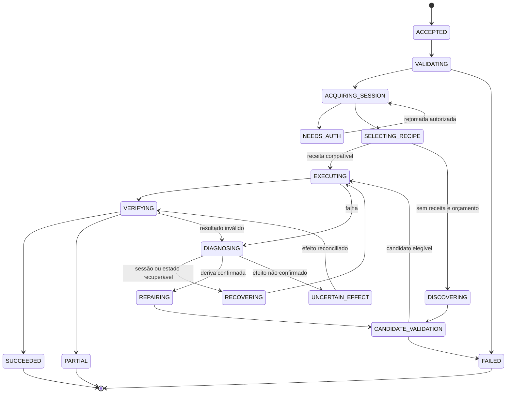

# Execução, Pescache e autorreparo

## 1. Máquina de estados



As transições de falha, cancelamento, orçamento e prazo também se aplicam aos estados ativos, embora omitidas do desenho para legibilidade. `NEEDS_AUTH` tem expiração. `UNCERTAIN_EFFECT` nunca transita diretamente para repetição de mutação. Reentrada em diagnóstico consome limite; a máquina não pode oscilar indefinidamente entre reparar e verificar.

No perfil inicial, o prazo total continua contando durante fila e autenticação. Retomada não estende `deadline_at`; uma sessão que ficou pronta depois da expiração pode ser usada em novo run. Mapeamento dos estados públicos, revisão, concorrência e contagem de prazo estão em [13 — API e estados](13-API-ESTADOS-E-CONCORRENCIA.md).

## 2. Caminho estável

1. Validar contrato e derivar contexto confiável.
2. Reservar orçamento e obter lease da sessão/instalação.
3. Confirmar sessão ou acesso público necessário.
4. Selecionar receita certificada compatível e fixar sua versão no run.
5. Aplicar bindings tipados, sem geração de texto quando o valor já existe.
6. Executar passos via broker, registrando intenção e resultado.
7. Extrair por parser determinístico.
8. Verificar identidade, filtros, escopo e conteúdo.
9. Persistir relatório e entregar resposta com referências.

O teste de zero inferência deve instrumentar todos os clientes de modelos e falhar se qualquer um for chamado nesse caminho. Não basta configurar o agente para pensar menos.

## 3. Chaves do Pescache

Índice de busca proposto:

```text
capability_id + capability_major + installation_id
+ access_role_variant + ui_variant + transport + runtime_compatibility
```

Parâmetros de negócio não entram obrigatoriamente na chave da receita porque o fluxo é parametrizado. Eles entram na identidade da execução e de um eventual cache de resultado. `ui_variant` pode derivar de sinais estruturais estáveis e versão declarada da interface; não usar hash integral do DOM como único discriminador.

Receita global contém somente conhecimento reutilizável. Locator dependente de conteúdo específico do cliente vira binding ou variante privada, não literal publicado globalmente. Assinaturas e exemplos guardados para reparo devem ser sanitizados.

## 4. Escada de recuperação

### Nível 0 — Regras locais

Reobservar quando a página ainda está carregando, esperar condição conhecida, fechar overlay reconhecido quando permitido ou relocalizar por alternativas certificadas. Não repetir ação com efeito incerto. Evitar sleeps fixos longos; preferir condição com timeout e observação limitada.

### Nível 1 — Correspondência estrutural

Usar múltiplos sinais: ID estável, nome, papel, label, contexto de formulário, XPath e atributos. Scrapling pode fornecer candidatos de estrutura. O candidato deve estar visível/habilitado, ter cardinalidade correta e satisfazer o papel semântico esperado. Similaridade não é autorização.

### Nível 2 — Jev

Enviar objetivo da etapa e candidatos atuais. Uma pergunta escolhe operação; perguntas de alvo são separadas por operação e podem compartilhar a chamada, como no Ultrafast. Consumir somente a cabeça correspondente à operação escolhida. Revalidar snapshot e alvo antes do envio.

Se Jev reencontra o botão correto, a execução pode continuar sem reconstruir todo o percurso. A observação da correção alimenta um candidato de atualização do locator, sujeito à política de promoção.

### Nível 3 — Descoberta generativa

Se o percurso mudou, usar o Agent do Browser Use para descobrir a operação dentro de limites. Fornecer objetivo, contexto de recurso, ações permitidas, checkpoints e critérios de sucesso fixos. A saída é trajetória e proposta de receita, não certificação.

### Nível 4 — Suspensão ou falha explícita

Se faltam acesso, suporte de controle, orçamento ou prova do resultado, devolver condição concreta. O sistema não deve aumentar autonomamente escopo, permissões ou tentativas para aparentar sucesso.

## 5. Classificar antes de reparar

| Sinal | Causa provável | Ação |
|---|---|---|
| Página de login após abrir recurso | Sessão expirada | Renovar/suspender sessão. |
| HTTP 429 ou aviso equivalente | Limite da fonte | Respeitar espera e reduzir pressão. |
| HTTP 200 com HTML de desafio | Controle de acesso | Adaptador de desafio; não parser de resultados. |
| Conexão CDP indisponível | Falha de runtime | Reconectar e verificar estado. |
| Campo existe com outro ID, mesmo papel | Deriva de locator | Localização adaptativa limitada. |
| Resultados chegaram, campos mudaram | Deriva de parser | Candidato de parser e regressão. |
| Filtro não foi aplicado | Erro semântico | Rejeitar resultado e corrigir percurso. |
| Timeout após enviar ato | Efeito incerto | Reconciliação pelo identificador/recibo. |

Regras produzem uma classificação inicial com evidência. Jev pode resolver ambiguidade, mas uma escolha do modelo não apaga sinais objetivos de acesso negado ou efeito incerto.

## 6. Produção de uma receita candidata

`RepairPatch` deve registrar:

- Receita e revisão de origem.
- Falha que motivou o reparo e evidências sanitizadas.
- Passos modificados e diferença estruturada.
- Bindings preservados e novos requisitos de estado.
- Casos de teste executados e verificadores aplicados.
- Compatibilidade declarada e limite de validade.
- Modelo/configuração usados e custo observado.

O reparador não pode alterar a identidade do processo esperado, o filtro solicitado, o contrato de saída, o escopo de acesso nem o verificador protegido. Se uma mudança exige novo contrato, é evolução de capacidade e passa por revisão de desenvolvimento.

## 7. Promoção

Separar dois fatos: a tarefa corrente foi resolvida corretamente; a receita é reutilizável em uma classe de tarefas. O primeiro exige verificação da execução. O segundo exige casos diversos, incluindo entradas diferentes, casos vazios, paginação e falhas.

Pipeline: validação de estrutura → análise de operações/efeitos → execução em fixtures → regressão da capacidade → execução limitada em fonte permitida → relatório → promoção atômica → canary → acompanhamento.

Para início do produto, candidatos que alteram percurso ficam sujeitos à revisão do desenvolvedor. Após acumular avaliação suficiente, políticas podem permitir promoção automática de classes estreitas de patch. Isso é configuração do produto, não autorização arbitrada pelo modelo.

## 8. Evitar tempestade de reparos

Usar lock por receita/variante, fila deduplicada e período de resfriamento. Outros runs podem aguardar, usar versão ainda funcional ou terminar com degradação declarada. Um erro compartilhado de rede ou portal abre circuit breaker; não cria milhares de versões candidatas.

Uma versão nova não invalida indiscriminadamente todas as variantes. Receita de usuário com papel diferente continua isolada. Promoção usa compare-and-swap sobre versão-base para não sobrescrever correção concorrente.

## 9. Reexecução e efeitos

Leitura HTTP pode usar POST e ato com efeito pode usar GET. `retryable` é propriedade semântica da capacidade e do estágio, não inferência do verbo HTTP. Após envio de mutação, registrar `dispatched`; sem confirmação, `uncertain`. A retomada consulta o efeito esperado antes de reenviar.

O JCP não promete exactly-once em portais sem suporte a idempotência. Ele oferece identificação de execução, prevenção local de duplicidade e reconciliação. Para leitura com sessão expirada, a retomada pode reiniciar a consulta; para assinatura/protocolo, precisa de procedimento específico.

## 10. Exemplo completo de falha e reparo

`tjsp.cjpg.search_decisions` usa uma receita cujo campo de pesquisa mudou de ID. A pré-condição detecta ausência do locator; o formulário e a instalação continuam reconhecidos. O resolvedor encontra dois campos candidatos. Jev escolhe o campo compatível com pesquisa livre. O broker confirma tipo e contexto, preenche a entrada e relê o valor. A busca retorna resultados e o verificador confirma filtros e escopo. A tarefa termina.

Em paralelo lógico ao encerramento da tarefa, um patch de locator entra na fila de validação. Passa por fixtures com campo renomeado e campo parecido incorreto, depois por casos de consulta diferentes. Somente então o ponteiro do Pescache pode avançar. Nenhuma credencial, número de processo ou resultado específico vira parte fixa da receita.
