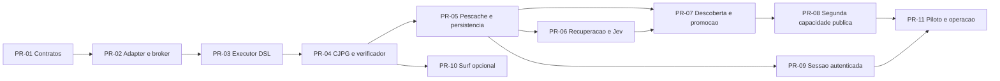

# Backlog executável e rastreabilidade

Este documento liga requisitos a unidades de implementação, dependências e provas de aceite. As PRs são uma divisão sugerida para o time; nenhuma PR foi criada nesta entrega. O objetivo é permitir começar a construir sem outra rodada ampla de pesquisa.

## 1. Fronteira entre o que está pronto e o que falta

| Entrega | Estado nesta revisão | Prova |
|---|---|---|
| Arquitetura, decomposição e decisões | Documentado | Documentos 01–09. |
| Perfil de contrato CJPG | Referência Python executada | Modelos, schemas e 34 testes em 10/12. |
| DSL e regras do executor | Especificado | Documento 11; receita sintética não executada. |
| API, estados, retomada, locks e contexto | Especificado | Documento 13. |
| Integração Browser Use executável | A implementar | PR-02 e PR-03 abaixo. |
| Consulta jurídica com JCP ponta a ponta | A implementar | PR-04 e aceite ao vivo limitado. |
| Reparo automático com promoção | A implementar | PR-06 e PR-07. |
| Jev integrado e medido no JCP | A implementar | PR-06. |
| Worker Surf compilado e certificado | A implementar | PR-10. |
| PJe/eproc com sessão autenticada | Dependente de ambiente e acesso de teste | PR-09 e pendências P06/P07. |

O código de contratos embutido em Markdown é uma referência utilizável. Ele não deve ser apresentado como núcleo do runtime já implementado. A quantidade de testes locais não é taxa de sucesso dos portais.

## 2. Ordem de PRs

O piloto público pode avançar sem PR-09; o diagrama mostra a dependência para um piloto que anuncia capacidades autenticadas. PR-10 é opcional e não bloqueia a tese central.

### PR-01 — Contratos e catálogo

**Criar:** modelos de envelope, schemas exportados, catálogo de capacidades, erros e fixtures de contrato. Usar o perfil de 10 como ponto de partida e separar o envelope comum dos tipos de cada capacidade sem abrir campos arbitrários.

**Aceite:** os 34 casos reproduzíveis passam; exemplos do pacote continuam válidos; propriedades desconhecidas, datas inválidas e mistura de versões são rejeitadas. Um catálogo com `supports_continuation=false` recusa cursor não nulo mesmo que o perfil estrutural reconheça o campo.

**Revisão:** confirmar que Result só é criado no servidor por código confiável e que a identidade do usuário não vem de `arguments`.

### PR-02 — BrowserUseAdapter e ActionBroker

**Criar:** sessão, página, observação, localização, interação e liberação concentradas no adapter. Registrar chamadas com orçamento, política e recibos. Fixar a versão upstream.

**Aceite:** uma página de fixture aceita `fill` e `click`, aguarda resultado por condição e libera recursos. Dois alvos semelhantes geram ambiguidade; origem não permitida e segredo sentinela não escapam. Testar comportamento de `ActionResult.error`, além de exceções.

**Revisão:** procurar chamadas diretas ao Actor/CDP fora da fronteira. Confirmar que a superfície final de ferramentas do Agent não mantém ações que bypassam o broker.

### PR-03 — Carregador e executor da DSL

**Criar:** gramática versionada, bindings fechados, validação estática, registro de condições/parsers, interpreter, timeout e encaminhamento de falha. Começar pela sequência necessária à fixture e acrescentar paginação limitada.

**Aceite:** fixture de consulta parametrizada funciona sem cliente LLM; falta de binding falha antes da ação; cancelamento e deadline impedem novas etapas. Operação não registrada e tentativa de alterar verificador são recusadas.

**Revisão:** verificar se laços e retries estão limitados, se parâmetros aparecem como dados e se a implementação não avalia código arbitrário da receita.

### PR-04 — Primeira claw CJPG

**Criar:** manifesto experimental, parâmetros reais, parser, estado vazio, paginação, objetos jurídicos, evidência e verificador. Converter conhecimento das automações existentes em testes e código adaptado com licença conferida.

**Aceite:** consulta pública real limitada retorna itens com origem e filtros; uma consulta vazia confirmada é distinguida de login/desafio/falha. Parser funciona em fixtures redigidos e detecta mudança estrutural. Inteiro teor fica fora da certificação até P03 ser encerrada.

**Revisão:** conferir datas, vínculos documentais, encoding e completude. Não aceitar “tabela encontrada” como prova de que os filtros foram aplicados.

### PR-05 — Pescache, runs e persistência

**Criar:** receitas imutáveis, seleção por variante, ledger de ações, idempotência transacional, leases, eventos/outbox, checkpoints e ponteiro ativo com CAS.

**Aceite:** segunda chamada com valores distintos reutiliza receita sem modelo; dois pedidos idênticos criam um run; corpo diferente com mesma chave conflita; queda do worker não duplica ação incerta. Resultados não vazam entre tenants.

**Revisão:** separar cache de procedimento, resultado e HTTP. O cache de receita não deve ter cookies, números de processo fixos ou literais obtidos da sessão de descoberta.

### PR-06 — Recuperação estrutural e Jev

**Criar:** classificador de falha, candidatos, adaptador de decisão, gate e consumo único. Scrapling fica atrás de uma interface opcional de geração de candidatos.

**Aceite:** campo renomeado é reencontrado em fixture; candidatos ambíguos e resposta fora da lista são recusados; decisão tomada sobre observação antiga não é executada. Valores de entrada conhecidos usam binding, sem helper de geração de texto.

**Revisão:** medir custo e taxa de recuperação correta. Não usar confiança do modelo como substituto de pós-condição. Todos os helpers contam no orçamento.

### PR-07 — Descoberta, patch e promoção

**Criar:** agente de descoberta restrito, bundle de falha, trace-to-recipe, diff, fila de regressão, política de promoção, canary e rollback.

**Aceite:** reparar a fixture B e rejeitar a fixture C enganosa do plano 08. A tarefa corrente pode concluir sem promover a receita. Dois reparadores não sobrescrevem correções concorrentes. O patch não troca o verificador nem relaxa filtros.

**Revisão:** distinguir locator, percurso, parser e contrato. Código novo de parser passa pelo desenvolvimento; não é executado arbitrariamente como saída de modelo.

### PR-08 — Segunda capacidade pública

**Criar:** CPOPG ou SCON conforme pendência de acesso resolvida. Implementar outro tipo de operação, como obter processo e movimentos, para testar a generalização além de busca textual.

**Aceite:** reutilizar broker, orçamento, protocolo, sessões e persistência sem copiar o executor por tribunal. Mudar somente pacote de capacidade, parsers, receitas, verificadores e configuração específica.

**Revisão:** qualquer `if tribunal` fora dos adaptadores deve ter justificativa concreta. Não forçar contratos diferentes a um objeto genérico sem identidade jurídica.

### PR-09 — Primeira capacidade autenticada

**Criar:** health check de sessão, aquisição assistida, vínculo de conta, expiração, retomada, challenge adapter e isolamento. Selecionar uma instalação e uma função de leitura com efeitos conhecidos.

**Aceite:** login existente é reaproveitado; sessão expirada vira `needs_auth`; token/revisão de retomada impedem duplicidade; conta de outro tenant e sessão revogada são recusadas. Registrar o que acontece se o prazo expirar durante autenticação.

**Revisão:** confirmar efeitos intermediários da abertura de documentos ou comunicações. A certificação é do percurso concreto, não da família PJe/eproc inteira.

### PR-10 — Transporte Surf

**Criar:** worker Go, protocolo de controle, supervisor, templates certificados, sessão, cancelamento e ArtifactRefs. Começar com um template público sem complexidade de sessão; só depois testar bridge autenticado quando compatível.

**Aceite:** build reproduzível; TLS inválido falha; redirects não vazam credenciais; leitura de `cancel` permanece responsiva durante requisição ativa; browser e HTTP produzem resultado equivalente no conjunto certificado.

**Revisão:** conferir toolchain, defaults reais de TLS, retries por efeito, bytes descomprimidos e fronteira de filesystem. Não assumir que perfis HTTP executam JavaScript ou resolvem autenticação por si só.

### PR-11 — Piloto operável

**Criar:** métricas, painel de saúde por instalação/capacidade, limites por fonte, retenção, redaction, operação de rollback, manifesto de cobertura e montador de ContextPack.

**Aceite:** demonstrar consulta, reuso sem inferência, reparo validado, recusa de erro semântico e limite de orçamento. Publicar benchmark representativo com amostra, falhas, configuração e custo total observado.

**Revisão:** materiais de produto devem refletir a matriz certificada. Não usar resultado local de contrato, teste de fixture ou benchmark Jev externo como prova de sucesso em todas as ferramentas jurídicas.

## 3. Matriz de rastreabilidade

| ID | Requisito | Especificação | Unidade de entrega | Evidência de aceite |
|---|---|---|---|---|
| R01 | Funções jurídicas estáveis | 01, 03, 10 | PR-01 | C01–C06 e T01/T03. |
| R02 | Execução sem inferência no caminho estável | 04, 05, 11 | PR-02/03/05 | T02; instrumentação de todos os clientes de modelo. |
| R03 | Receitas parametrizadas | 03, 11 | PR-03/05 | T20 e segunda consulta com valores distintos. |
| R04 | Diferenciar vazio, falha e autenticação | 07, 10, 12 | PR-01/04/09 | C02/C05/C06, N09/N26 e T04/T05. |
| R05 | Identidade, filtros e proveniência | 03, 07, 10 | PR-04 | N12/N13/N21 e verificação de fonte real. |
| R06 | Cobertura e continuação explícitas | 03, 07, 13 | PR-04/05 | C03, N10/N11/N22, T08 e teste de cursor. |
| R07 | Jev restrito a escolhas observadas | 04, 09, 11 | PR-06 | T18, stale observation e consumo único. |
| R08 | Reparar sem mudar o significado | 04, 11 | PR-07 | T06/T07, fixtures B/C e diff protegido. |
| R09 | Promoção e rollback controlados | 04, 07, 13 | PR-05/07 | T12/T21, CAS e versão-base. |
| R10 | Login existente e isolamento | 05, 07, 13 | PR-09 | T11/T17, expiração e retomada real autorizada. |
| R11 | Governança de efeitos | 04, 07, 13 | PR-02/05/09 | T13/T19 e reconciliação em queda. |
| R12 | Surf como otimização certificada | 05, 09, 13 | PR-10 | T15/T16, build e equivalência. |
| R13 | Recuperação sob demanda | 01, 13 | PR-04/11 | Nova consulta ao vivo com origem e frescor declarados. |
| R14 | Reuso sem acumular acervo obrigatório | 01, 07 | PR-05/11 | Política distinta para receitas, conteúdo e evidências. |
| R15 | Orçamento global finito | 03, 04, 10, 13 | PR-03/05/06 | N19/N20, T09 e deadline com login. |
| R16 | Página não controla o agente | 07, 11 | PR-02/07 | T10; tentativa de instrução embutida recusada. |
| R17 | Escalar por instalação certificada | 01, 06, 08 | PR-08/09/11 | Matriz pública de capacidades e variantes testadas. |
| R18 | Conhecimento preservado para continuidade | 09, PENDENCIAS, 14 | Documentação atual | Commits, conclusões e pendências acionáveis. |

`Txx` refere-se à suíte de aceitação planejada em 08. `Cxx/Nxx` refere-se aos testes de contrato executados em 12. A tabela distingue os dois para que não se anuncie como executado aquilo que é critério futuro.

## 4. Perguntas que cada PR precisa responder

- Qual contrato externo ficou implementado ou mudou?
- Qual arquivo/versão upstream foi usado e há dependência de método privado?
- Qual comportamento foi testado e qual ainda depende de acesso real?
- Há inferência no caminho estável ou apenas na recuperação declarada?
- Quais estados de falha foram tratados sem produzir falso sucesso?
- Como reverter a mudança e quais receitas/variantes ela afeta?

Essas perguntas são critérios de revisão do projeto, não pedidos de aprovação para escrever esta documentação.

## 5. Primeira sessão de implementação

Extrair os contratos conforme documento 12 e executar os 34 testes. Preparar o fork fixado e implementar a fixture de consulta com o adapter mínimo. Conectar o broker e o interpretador até obter uma resposta validada. Só então substituir a fixture pelo primeiro percurso real CJPG.

Registrar os resultados no arquivo de pendências, mantendo separados build, teste local, ensaio ao vivo e certificação. Se a API upstream mudar, corrigir o adapter e seu teste; não começar outra pesquisa geral do projeto.
