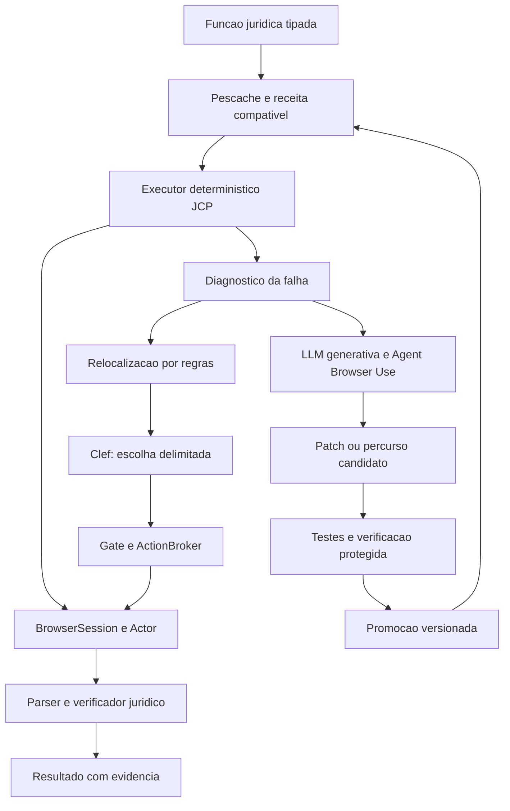

# Aplicabilidade do Clef ao JCP

## Conclusão de engenharia

O pivot é tecnicamente coerente: Clef substitui o provedor de decisões delimitadas do JCP. O Browser Use continua como base de navegador, observação, ações e agente de descoberta. A LLM generativa permanece no projeto para geração de código, construção de reparos e tarefas que excedam as opções que o controlador sabe apresentar.

O encaixe correto é `DecisionProvider.decide(state, questions)`, dentro do módulo M5, seguido por um gate determinístico e pelo ActionBroker. Não basta colocar `Clef` no parâmetro `llm` do Agent existente: a interface generativa do Browser Use e a saída de distribuição por opções do Clef cumprem funções diferentes. Essa conclusão deriva de `browser_use/llm/base.py` e do `systemone` do modelo, identificados no [mapa do código](MAPA-DO-CODIGO.md).

## 1. Arquitetura do MVP após o pivot

As arestas representam caminhos possíveis, não uma sequência obrigatória para toda falha. Sessão expirada, bloqueio, indisponibilidade e efeito incerto possuem tratamento específico. O orquestrador não chama modelos apenas para confirmar uma condição já comprovada por regra.

### Caminho estável

A função recebe argumentos, seleciona uma receita, executa, extrai e verifica. Nenhuma chamada ao Clef ou à LLM é necessária quando a receita funciona. O custo dominante pode continuar sendo o portal; reduzir inferência não elimina tempo de autenticação, carregamento ou download.

### Recuperação de alvo

Se um locator falhar, o resolvedor produz candidatos observados. Clef escolhe entre opções permitidas, inclusive abster-se. O broker confirma contexto, geração da observação e política antes da ação. O verificador confirma que a operação jurídica permaneceu correta.

### Reconstrução de percurso com ações conhecidas

Clef também pode escolher sucessivamente ações de uma gramática já conhecida: abrir menu observado, selecionar aba, preencher campo com parâmetro fornecido e avançar. Uma trajetória assim pode virar receita pela compilação determinística do trace. Isso não exige que o modelo gere texto de programa.

Esse caminho tem limite: ele depende de candidatos, bindings, parsers e condições que o JCP consegue representar. Se faltar uma transformação, um parser ou uma interpretação de tarefa que não esteja na gramática, entra a LLM generativa. O código gerado passa por validação, testes e revisão de acordo com a classe de mudança; não ganha execução irrestrita por ter sido gerado pelo modelo.

## 2. Escolha entre Clef e Clef-flash

Proposta inicial: `clef` como padrão de decisão, com configuração por capacidade. `clef-flash` entra em decisões repetitivas depois de demonstrar precisão suficiente no conjunto jurídico. O objetivo inicial é evitar ação incorreta, e não apenas minimizar milissegundos de inferência.

A imagem enviada pelo usuário contém diferenças relevantes:

| Métrica da imagem | Clef | Clef-flash | Jev | Implicação para a avaliação JCP |
|---|---:|---:|---:|---|
| BFCL, case exact | 98,47 | 98,76 | 95,75 | Hipótese favorável à escolha de ferramentas; ainda falta testar candidatos de portais. |
| When2Call, accuracy | 72,37 | 65,58 | 80,97 | Não delegar cegamente ao modelo a decisão de quando agir. |
| CLINC150+OOS, macro-F1 | 97,43 | 66,77 | 89,27 | Medir abstenção e entradas fora da distribuição, sobretudo no Flash. |
| BRIGHT, nDCG@10 | 45,91 | 39,26 | 47,52 | Não deduzir superioridade universal em recuperação de informação. |

Os valores da imagem coincidem com o [anúncio oficial](https://blog.cloudflare.com/clef-decision-models/). A publicação informa medianas de 209,3 ms para Clef, 38,8 ms para Flash e 524,1 ms para Jev em sua avaliação. Esses tempos não são medições do JCP, nem latência ponta a ponta dos tribunais. O estudo não reproduziu a inferência.

O gate de ação, a conferência de identidade e a conclusão de sucesso continuam determinísticos. A distribuição produzida pelo modelo serve à decisão; não é probabilidade validada de acerto jurídico no nosso domínio.

## 3. Estratégia de implantação

### Workers AI para a primeira integração

O runtime Python chama o endpoint REST de Workers AI por um adapter assíncrono. Browser Use não precisa migrar para um Cloudflare Worker. Sessão do portal, CDP, downloads e ActionBroker continuam onde o runtime está implantado.

Vantagens para o MVP: não requer baixar pesos nem operar GPU antes de testar o encaixe. Dependências novas: conta, autorização de API, disponibilidade do serviço e política de envio de estado. A chamada deve transportar somente o contexto necessário e sanitizado.

O endpoint e o envelope HTTP são tratados pelo adapter, não espalhados em cada claw. Transporte externo, timeout e falha de autenticação retornam erro tipado de provedor; não viram uma opção inventada pelo modelo. Os detalhes estão em [Contrato e avaliação](CONTRATO-E-AVALIACAO-CLEF.md).

### Hospedagem própria como alternativa

O código e os pesos foram publicados pela Cloudflare sob Apache 2.0. O carregador inspecionado monta backbone, cabeça conjunta e processor. Um servidor que apenas carregue um modelo de geração genérico, ignorando essa cabeça, não implementa automaticamente o caminho de decisão estudado. [Modelo Clef](https://huggingface.co/Cloudflare/clef) e [código fixado](https://huggingface.co/Cloudflare/clef/blob/2f3de3dd85f379784083b0814d997ab627200f0c/joint_schema_model.py).

A estimativa bruta de pesos BF16 é da ordem de 54 GB para 27 bilhões de parâmetros e 18 GB para 9 bilhões, antes de demais necessidades de execução. É uma conta de capacidade, não um requisito mínimo de GPU medido. Quantização e servidores alternativos precisam comprovar preservação da cabeça e das decisões. Não foram baixados pesos nem executada inferência local nesta entrega.

## 4. Aplicação nos cinco portais já mapeados

| Superfície | Uso útil de Clef | Regra que deve ficar fora do modelo |
|---|---|---|
| TJSP CJPG | Reencontrar campo, botão ou continuação entre candidatos observados. | Filtros aplicados, datas, identidade e cobertura da busca. |
| TJSP CPOPG | Escolher seção de movimentos/documentos após mudança de interface. | Número do processo e vínculo do documento obtido. |
| STJ SCON | Distinguir layouts de resultado e selecionar navegação conhecida. | Desafio de acesso não é zero resultados e não é falha de parser a corrigir cegamente. |
| PJe TRT2 | Escolher menu/aba em sessão pronta e sinalizar estado ambíguo. | Permissão, expiração e eventual efeito da abertura de comunicação. |
| eproc JFRS | Navegar em menus observados para a função autorizada. | Identidade da conta, processo e efeito de cada operação. |

São propostas de aplicação, não cinco integrações testadas com Clef. A pesquisa anterior observou partes públicas e de autenticação e registrou suas limitações na SDD.

## 5. O que o código revelou

O código local de Clef ordena opções de `choice` para encoding, preserva IDs e converte logits em distribuições. `score` é uma expectativa numérica; `noul` é uma probabilidade de verdadeiro. O caminho local pode truncar o final do estado para caber no limite. Foram exercitadas funções de preparação/conversão em 18 checks locais, sem carregar o modelo.

Consequências para o JCP: usar IDs estáveis em vez de posição de lista; não converter `score` diretamente em índice; definir regra explícita para `noul`; rejeitar distribuições inválidas; preparar estado compacto antes da chamada; e manter identidade, escopo e política no controlador, independentemente do que foi enviado ao modelo.

## 6. Critério de viabilidade

O primeiro marco é provar uma única capacidade com quatro situações: receita funciona sem inferência; locator muda e Clef ajuda a recuperar; candidato enganoso é recusado; mudança maior é encaminhada à LLM generativa e vira patch testado. A partir desse circuito, medir qualidade, abstenção, custo, latência total e taxa de reparo promovido.

O modelo é uma peça substituível. O diferencial do JCP continua sendo a combinação de contratos jurídicos, conhecimento operacional persistente, execução sob demanda e verificação independente.
